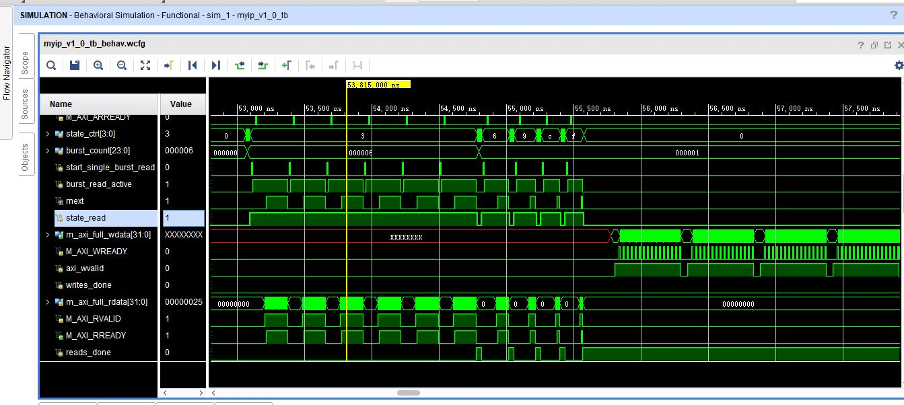
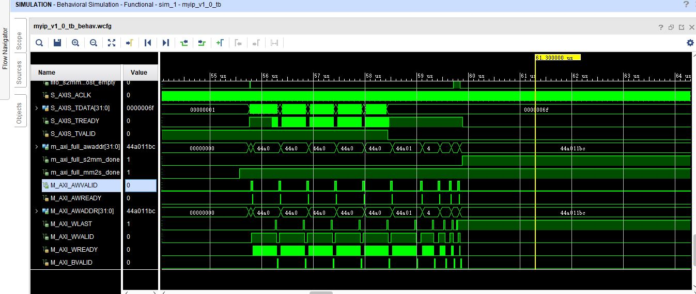

# DMA-S2MM-and-MM2S

Build an open-source, extremely simple AXI DMA.

***

## 一、设计概述

### 1.1 设计目的

​	本项目构建了一个开源、极简的`AXI DMA IP`，来帮助ZYNQ实际开发中更简单易行地完成大规模数据搬运。

### 1.2 基本功能

​	该IP核，支持传输任意长度32位数据 **(最大为`2^24-1`个)**，通过状态机控制，AXI4读写通道传输主要使用的突发长度为 16 ,剩余分别使用突发长度为 8、4、2、1 进行补全。


***
## 二、系统组成

### 2.1 整体介绍


#### 2.1.1 系统架构


**数据传输流程：**

​	外部通过AXI4-lite接口写入IP内部控制寄存器，启动对应通道的状态机完成相应的连续读写操作。读写通道均包含一个同步FIFO用于数据缓冲，从而实现AXI4与Stream数据之间的转换。


#### 2.1.2 代码结构

​	结构组成如下：


***
## 三、性能参数
### 3.1 资源消耗


## 四、功能验证

共建立以下工程完成仿真与验证。

### 4.1 环路仅仿真

**DMA_simulation**

1. 工程结构：

​	利用`AXI VIP`作为AXI4从机存储数据,通过`vivado`生成的`AXI4-full-master`例程写入初始化数据.同时也生成了`AXI4-lite-master`例程修改部分代码用于配置DMA内部控制寄存器,diagram中进行两次例化,一次用于配置读通道,一次用于配置写通道.然后调用`AXI4-Stream Data FIFO`IP用于验证读写通道的缓存.

​	结构示意图如下:


2. 仿真结果：

   读通道：




​       写通道：



### 4.2 环路开发板验证

 1. 工程结构：

    在型号为`xc7z010clg400-1`的米联客`MZ701Amini`开发板完成实际验证。通过EMIO对IP启动与完成信号控制或接收，调用`AXI4-Stream Data FIFO`IP用于验证读写通道的缓存。

​	结构示意图如下:


2. 验证结果：

   读写数据符合。

### 4.3 摄像头采集系统

1. 工程结构：

​	在型号为`xc7z010clg400-1`的米联客`MZ701Amini`开发板实现DMAOV7725 DMA三缓存图像采集显示。

​	结构示意图如下:


2. 测试结果：

   输出HDMI实时显示30帧，图像均匀不断裂。

## 五、总结与拓展

### 5.1 历程总结

​	代码编写为时一个多月，从18年12月到19年1月，因为白天上班实习的原因，所以coding是在晚上回家以后以及周末空闲时间，所以进度不是很快，断断续续的完成了。


​	在开发过程中，在视频采集中遇到一个BUG，摄像头数据始终未被写到DDR，最后发现原因是负责S2MM的AXIS接口信号控制中，FIFO满信号将axis_tready置0，但是并未重启，所以将这边添加重启控制后得以work了。

​	修改后的信号控制：

```verilog
	always @(posedge S_AXIS_ACLK)
	begin
		if(!S_AXIS_ARESETN)
			axis_tready<=1'b0;
		else if(work_signal==0)
		    axis_tready<=1'b0;
		else if(fifo_s2mm_full)
			axis_tready<=1'b0;
		else if( fifo_s2mm_almost_full && rx_en )
			axis_tready<=1'b0;
		else if( (!fifo_s2mm_full) && (!axis_tready) && S_AXIS_TVALID )
			axis_tready<=1'b1;
		else
			axis_tready<=1'b1;
	end
```


### 5.2 拓展之处 

​	方便使用者灵活配置该IP，可将写入控制寄存器的AXI4-lite接口独立出来。

​	如果将独立的AXI4-lite接口去掉，自主编写RTL逻辑，从DMA IP外部直接输入`4×32bit`控制寄存器信号，完成传输控制。
