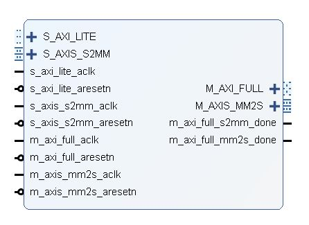
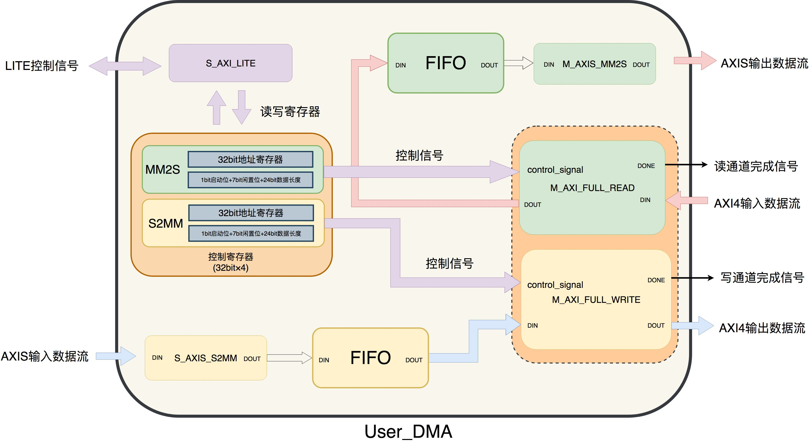
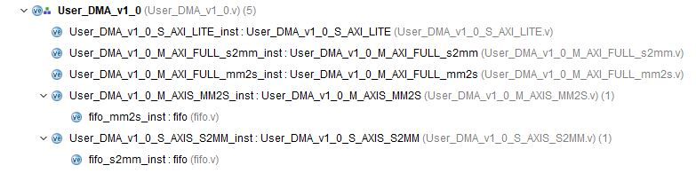
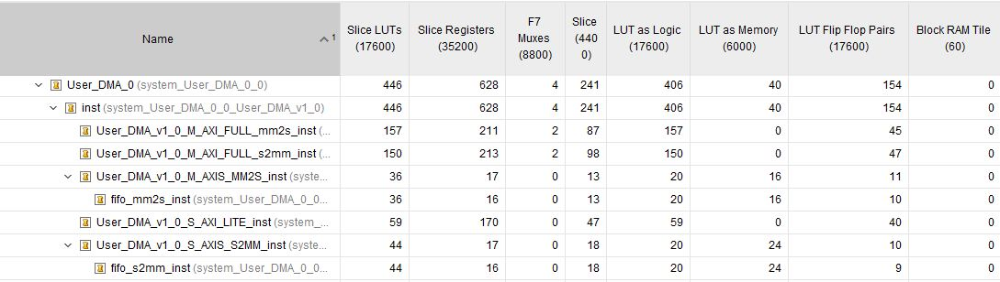
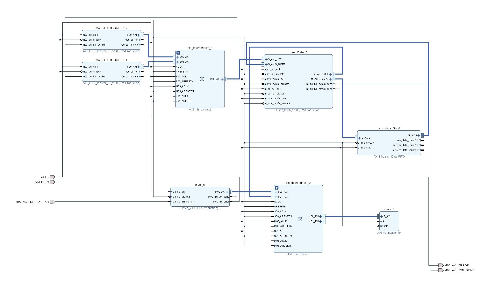
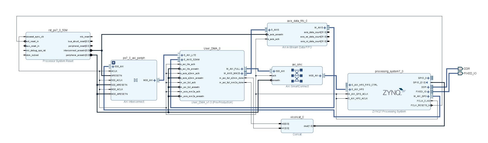
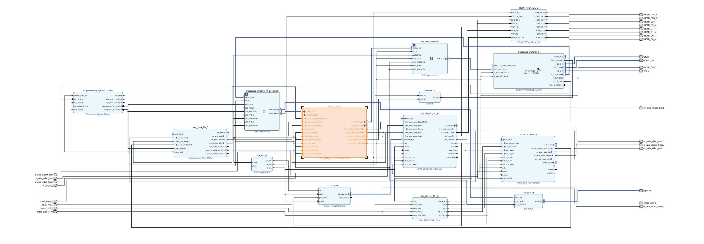

# DMA-S2MM-and-MM2S

Build an open-source, extremely simple AXI DMA.

***

## 一、设计概述

### 1.1 设计目的

​	本项目构建了一个开源、极简的`AXI DMA IP`，来帮助ZYNQ实际开发中更简单易行地完成大规模数据搬运。

### 1.2 基本功能

​	该IP核，支持传输任意长度32位数据 **(最大为`2^24-1`个)**，通过状态机控制，AXI4读写通道传输主要使用的突发长度为 16 ,剩余分别使用突发长度为 8、4、2、1 进行补全。

***
## 二、系统组成

### 2.1 整体介绍

#### 2.1.1 系统架构

数据传输流程：

​	外部通过AXI4-lite接口写入IP内部的控制寄存器，启动对应通道的状态机完成相应的连续读写操作。读写通道均包含一个同步FIFO用于数据缓冲，从而实现AXI4与Stream数据之间的转换。

#### 2.1.2 代码结构

​	结构组成如下：

#### 2.1.3 参数配置

（待完善）

1. 数据宽度：

   支持32/64bit切换。

2. 内部fifo大小

   支持参数配置内部fifo深度。

#### 2.1.4 内部接口介绍

（待完善）

介绍user_dma顶层信号：

1. full_s2mm
2. stream_s2mm
3. full_mm2s
4. stream_mm2s
5. fifo

### 2.2 详细介绍

（待完善）

#### 2.2.1 控制寄存器

1. 寄存器组成:
2. 传递控制:
   * 启动
   * 地址
   * 突发长度

#### 2.2.2 AXI4接口

1. 单次突发传输状态机
2. 顶层控制状态机
3. 关键信号分析

#### 2.2.3 AXIS接口

1. fifo控制

2. 关键信号控制

***
## 三、性能参数
### 3.1 时序分析

（待补充）

### 3.2 资源消耗

## 四、功能验证

共建立以下工程完成仿真与验证。

### 4.1 环路仅仿真

DMA_simulation

1. 工程结构：

​	利用`AXI VIP`作为AXI4从机存储数据,通过`vivado`生成的`AXI4-full-master`例程写入初始化数据.同时也生成了`AXI4-lite-master`例程修改部分代码用于配置DMA内部控制寄存器,diagram中进行两次例化,一次用于配置读通道,一次用于配置写通道.然后调用`AXI4-Stream Data FIFO`IP用于验证读写通道的缓存.

​	结构示意图如下:

2. 波形分析：

（待补充）

### 4.2 环路开发板验证

 1. 工程结构：

    在型号为`xc7z010clg400-1`的米联客`MZ701Amini`开发板完成实际验证。

    结构示意图如下:

2. SDK：

   （待补充）

3. 串口打印信号：

   （待补充）

### 4.3 摄像头采集系统

​	在型号为`xc7z010clg400-1`的米联客`MZ701Amini`开发板完成实际验证。

​	

​	结构示意图如下:

## 五、总结与拓展

### 5.1 历程总结

问题集中程度

### 5.2 拓展之处 

通过以下扩展，方便使用者使用。

#### 5.2.1 纯逻辑配置

（待完善）

​	为了方便使用者灵活配置该IP，将写入控制寄存器的AXI4-lite接口独立出来，可供增减。

​	效果图：

​	如果去除5.2.1独立的AXI4-lite接口，可以自主编写RTL逻辑，从DMA IP外部直接输入`4×32bit`控制寄存器信号，完成传输控制。

​	效果图：

#### 5.2.2 视频帧管理

（待完善）

## 六、参考文献

参考博客：

参考文档：